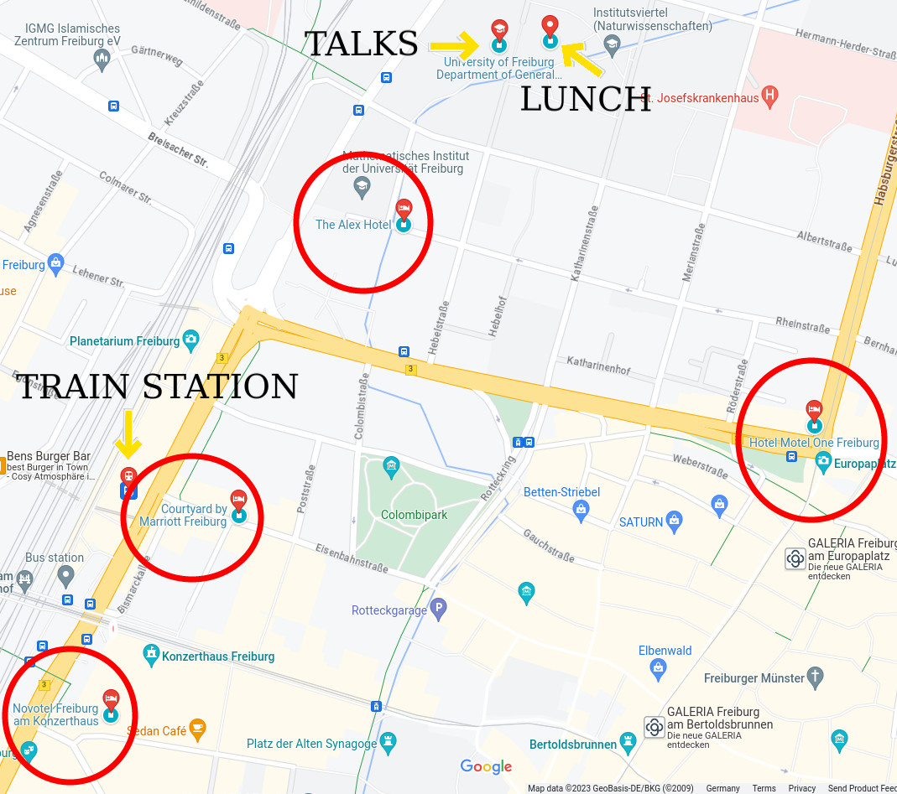

<html> 
<body>
All talks will be held in Höorsaal II, in the Department of Geology, Albertstr. 23b. It is on the first floor (on the second floor if you speak US english).

  
 
     

       
     

  

To move around Freiburg and in the area, you can use:
<ul>
  <li> <a href="https://www.vag-freiburg.de/">Public transportation.</a></li>
  <li> <a href="https://www.bahn.de">Trains.</a></li>
  <li> The <a href="https://www.frelo-freiburg.de/de/">city bike sharing service</a>.</li>
</ul>

</body>

</html>
