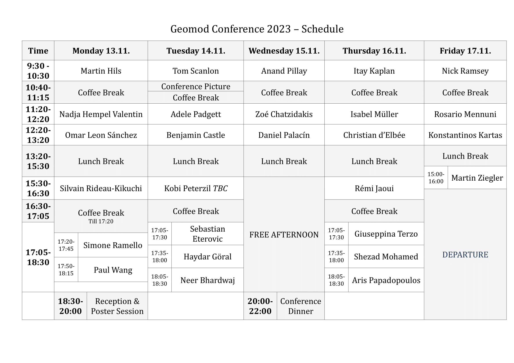

<h3>   <a href="https://fgallinaro.github.io/geomod-conference.github.io/speakers">Speakers</a>  | <a href="https://fgallinaro.github.io/geomod-conference.github.io/financial-support">Financial Support</a> | <a href="https://fgallinaro.github.io/geomod-conference.github.io/travel-information">Travel Information</a> | <a href="https://fgallinaro.github.io/geomod-conference.github.io/childcare">Childcare Support</a> </h3>

<html>
  
<body>
All talks will be held in Höorsaal II, in the Department of Geology, Albertstr. 23b. It is on the first floor (on the second floor if you speak US english).

  
 
     

       
     

  

A .pdf version, with the abstracts of the talks, can be downloaded <a href="https://fgallinaro.github.io/geomod-conference.github.io/ProgramAndAbstracts.pdf">here</a>. 

The lecture room is equipped with an efficient board system, similar to Oberwolfach if you are familiar with that. There are six boards arranged in three colums of two, sliding up and down.

If you prefer to give a beamer talk, please let us know in advance and either send us your slide as soon as possible or have them ready on a USB stick before your talk.

</body>

</html>

